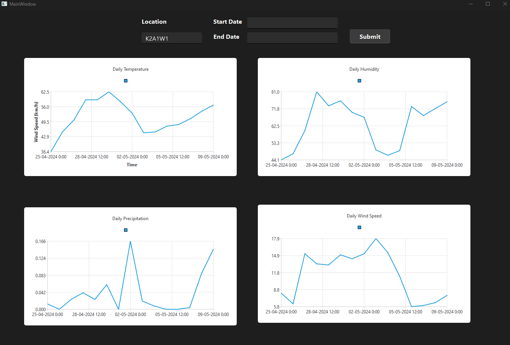
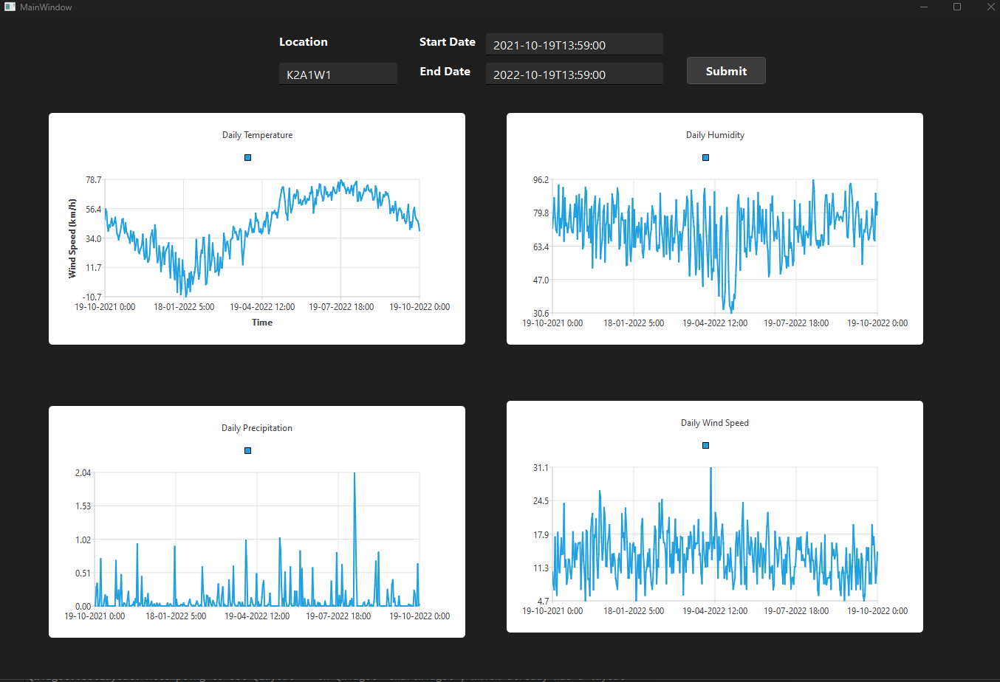

# Weather Analysis App with C++: An application for Weather Analytics made by C++

## Table of Contents
* [Introduction](#introduction)
* [Running App](#running-app)
* [Documentation](#documentation)
* [Contact](#contact)
* [License](#license)

## Introduction
The app analyze the weather data fetched from [Weather Data API](https://www.visualcrossing.com/weather-api).

## Running App
You can run WeatherApp project on QT Creator.

## Documentation
* After running the app, if you just click [submit] without inputting any paramters, you can get  the forecast of next 15 days weather.

* If you click [submit] after inputting [Start Date] and [End Date], you can get the analysis data of the weather in that range.

## Contact

## License
[GNU GPL](LICENSE.txt)

